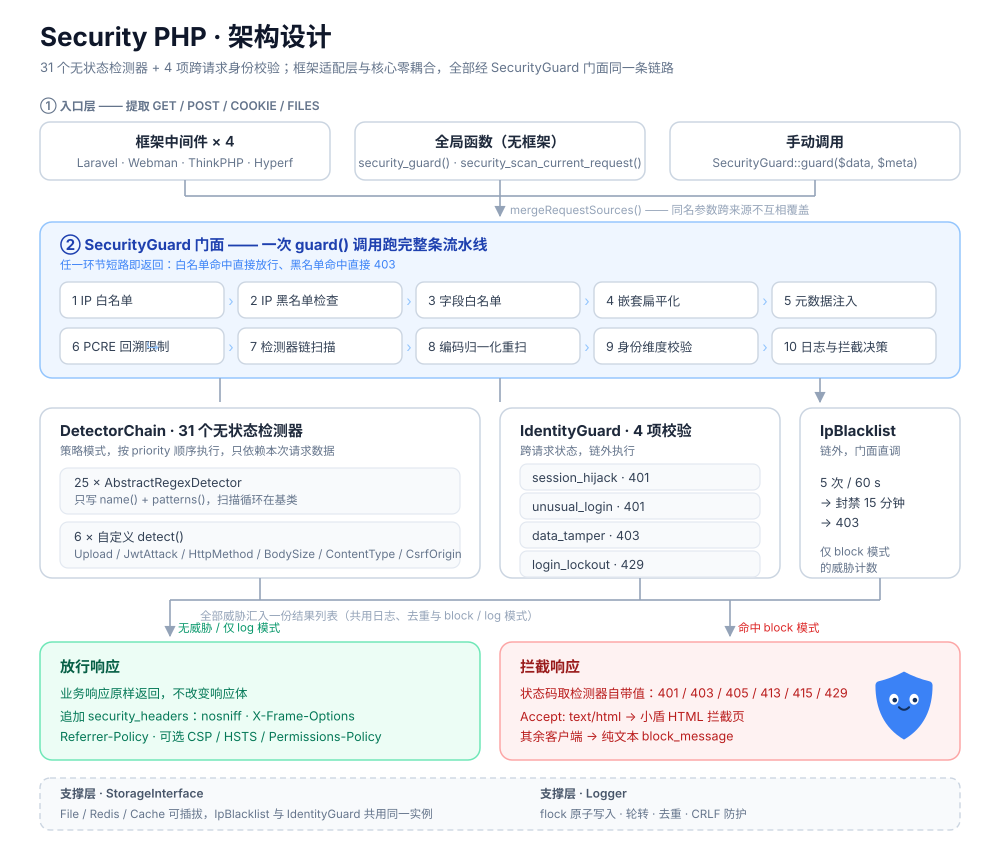
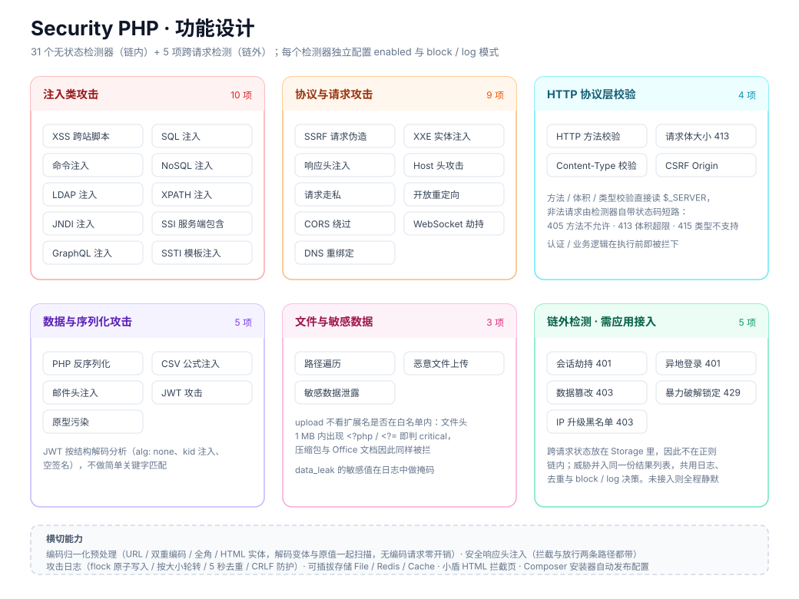
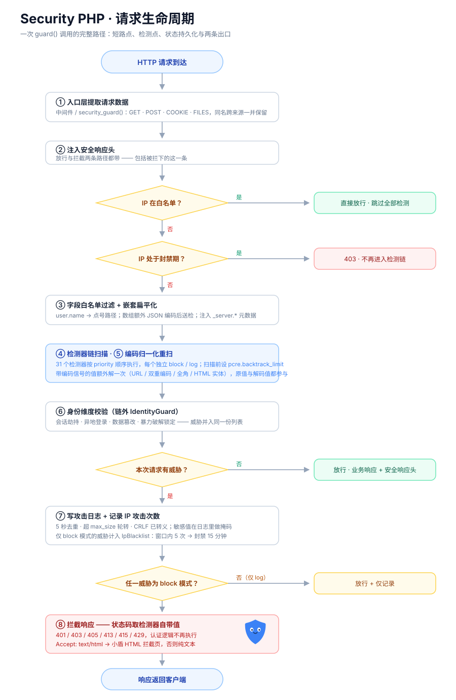

# Security PHP

> [English Documentation](README_EN.md)

基于 PHP 的安全攻击检测插件，内置 31 个无状态攻击检测器与 4 项跨请求身份校验，兼容 Laravel、Webman、ThinkPHP、Hyperf 框架，也可**脱离框架**用全局函数直接接入。项目宠物是**小盾** —— 一块举着放大镜、站在门口挡攻击的蓝色盾牌。

Copyright (c) 2026 erik <erik@erik.xyz> — https://erik.xyz

---

## 项目宠物：小盾


小盾是一块蓝色盾牌，表情友好，手里举着放大镜：**盾**代表拦下来，**放大镜**代表看得见。矢量图 `docs/mascot.svg`，透明背景，任意尺寸不失真。

它出现在三个地方：

| 位置 | 文件 | 说明 |
|---|---|---|
| README / 文档 | `docs/mascot.svg` | 项目形象，可当头像或配图 |
| 架构图 / 生命周期图 | `docs/svg/*.svg` | 「拦截响应」环节里的小盾 |
| **被拦截的浏览器页面** | `src/BlockPage.php` | 真实生效的代码，见「拦截配置」 |

小盾只负责出镜，不参与任何判定 —— 它的有无不会改变检测结果。

---

## 项目说明

Security PHP 是一个轻量级 PHP 安全中间件，通过正则模式匹配和结构分析检测常见的 Web 攻击载荷。每个检测器独立可配置（启用/禁用 + 拦截/日志模式），支持 IP 白名单（含 IPv4/IPv6 CIDR）、IP 攻击升级黑名单（5次/60s → 封禁15分钟）、字段白名单、日志轮转和去重。检测器可返回自定义 HTTP 状态码（405/413/415 等）。持久化数据支持 File/Redis/Cache 三种存储后端，可按需切换。在无状态的正则检测之外，`identity` 模块另提供**会话劫持 / 异地登录 / 数据篡改 / 登录暴力破解锁定**四类跨请求检测，Cookie 与会话 Token 登录都在覆盖范围内（见「身份维度检测」）。此外内置编码归一化预处理（对抗 URL 编码、全角字符、HTML 实体绕过）与安全响应头注入。框架中间件与无框架全局函数 `security_guard()` 走同一条链路、能力一致。被拦下时，浏览器收到的是一页带小盾的 HTML 拦截页，API 客户端收到的仍是纯文本。

### 支持的攻击类型

#### 注入类攻击

| 检测器 | 说明 |
|---|---|
| `xss` | XSS 跨站脚本 — `<script>`、事件处理器 `on[a-z]+=`、SVG/CSS 注入、`javascript:` URI |
| `sql_injection` | SQL 注入 — UNION SELECT（含 `/**/`、`(` 绕过）、sleep/benchmark/pg_sleep、布尔盲注、schema 枚举、存储过程执行 |
| `command_injection` | 命令注入 — 反引号、`$()`、管道符、`/dev/tcp`、PHP 代码执行函数、链式执行 |
| `nosql_injection` | NoSQL 注入 — MongoDB `$ne`/`$gt`/`$regex`/`$where` 操作符、认证绕过 |
| `ldap_injection` | LDAP 注入 — 过滤操作符 `(|)`、`(&)`、`(!)`、通配符、属性枚举、hex 编码逃逸 |
| `xpath_injection` | XPATH 注入 — 布尔绕过 `1=1`、`|` 联合操作、`count/string/substring` 盲注函数 |
| `jndi_injection` | JNDI/Log4Shell — `${jndi:ldap://`、`${lower:j}` 混淆、`${env:}` 环境变量查找 |
| `ssi_injection` | SSI 服务端包含 — `<!--#exec cmd=`、`<!--#include file=`、`<!--#echo var=` |
| `graphql_injection` | GraphQL 注入 — 内省 `__schema`/`__type`、深度嵌套 DoS、mutation 检测 |
| `ssti` | SSTI 服务端模板注入 — Jinja2 `{{}}`、FreeMarker `${}`、ERB `<% %>`、Python MRO 遍历 |

#### 协议与请求攻击

| 检测器 | 说明 |
|---|---|
| `ssrf` | SSRF 服务端请求伪造 — 内网 IP、cloud metadata (169.254.169.254)、IPv6 loopback、gopher/dict 危险协议 |
| `xxe` | XXE XML 外部实体注入 — `<!ENTITY` SYSTEM/PUBLIC、参数实体、DOCTYPE 声明 |
| `header_injection` | HTTP 响应头注入 — CRLF (`%0d%0a` / `\r\n`)、Set-Cookie/Location/Content-Length 注入 |
| `host_header` | Host 头攻击 — CRLF Host 注入、`X-Forwarded-Host`/`X-Original-URL` 投毒 |
| `request_smuggling` | HTTP 请求走私 — Transfer-Encoding/Content-Length 不一致、双重 TE 头、折叠头混淆 |
| `open_redirect` | 开放重定向 — `//evil.com` 协议相对 URL、`javascript:`/`data:` 伪协议 |
| `cors` | CORS 绕过 — `Origin: null`、`Access-Control-Allow-*` 头注入、preflight 投毒 |
| `websocket` | WebSocket 劫持 — Upgrade 头注入、null Origin 绕过、ws:// URL 检测 |
| `dns_rebinding` | DNS 重绑定 — Host 头内网 IP、localhost、无 TLD 短主机名 |

#### HTTP 协议层校验

| 检测器 | 说明 |
|---|---|
| `http_method` | HTTP 方法校验 — 仅允许配置的 HTTP 方法（GET/POST/PUT/DELETE/HEAD/OPTIONS/PATCH），非法方法返回 **405** |
| `body_size` | 请求体大小限制 — 超过配置上限（默认 10MB）返回 **413** |
| `content_type` | Content-Type 校验 — 仅允许配置的 MIME 类型，非法类型返回 **415** |
| `csrf_origin` | CSRF Origin 检查 — 检测跨域请求 Origin 头是否与 Host 匹配，支持额外跨域白名单 |
| `ip_blacklist` | IP 攻击升级黑名单 — 同一 IP 在窗口时间内触发 N 次攻击后自动封禁（默认 5次/60s → 封禁15分钟），数据通过可插拔存储后端（File/Redis/Cache）持久化 |

#### 数据与序列化攻击

| 检测器 | 说明 |
|---|---|
| `deserialization` | PHP 反序列化 — `O:数字:` / `C:数字:` 序列化对象、`unserialize()` 调用、魔术方法引用 |
| `csv_injection` | CSV 公式注入 — `=cmd|`、`=powershell`、`HYPERLINK()` 等 Excel 公式攻击 |
| `mail_header` | 邮件头注入 — Bcc/Cc/From/To 注入、MIME multipart 注入 |
| `jwt_attack` | JWT 攻击 — **结构解码分析**：`alg: none` 绕过、`kid` 路径遍历注入、空签名检测 |
| `prototype_pollution` | JS 原型污染 — `__proto__`/`constructor` 键检测、`__defineGetter__`/`__defineSetter__` |

#### 身份与完整性（需应用接入，见「身份维度检测」）

| 检测器 | 说明 |
|---|---|
| `session_hijack` | 会话劫持 — 首次请求把会话标识绑定到指纹（UA + IP 网段），之后指纹变化即告警，返回 **401**。Cookie 与 `Authorization: Bearer` / `X-Token` 两种登录态共用一套逻辑 |
| `unusual_login` | 异地登录 — 记录每个账号的常用登录地，出现新地点即告警，返回 **401** |
| `data_tamper` | 数据篡改 — 校验受保护字段的 HMAC 签名，值被改动、签名被剥离/伪造/过期即告警，返回 **403** |
| `login_lockout` | 登录暴力破解锁定 — 滑动窗口内失败次数达阈值即锁定账号，锁定期间直接返回 **429**，认证逻辑无需执行 |

#### 文件与敏感数据

| 检测器 | 说明 |
|---|---|
| `path_traversal` | 路径遍历 — `../`/`..\\`、`php://filter`/`php://input`、null 字节、URL 编码绕过 |
| `upload` | 恶意文件上传 — 扩展名白名单 + PHP 标签 (`<?php`, `<?=`) 内容扫描 |
| `data_leak` | 敏感数据泄露 — 信用卡号、AWS Access Key、私钥头 `-----BEGIN`、数据库连接串、API Token、JWT Secret |

> `upload` 的内容检查在文件头部 1MB 内匹配 `<?php` / `<?=`，且**不看扩展名是否在白名单内** —— 压缩包、Office 文档、含 PHP 片段的文本都会被判 `critical`，这是为堵绕过而做的取舍。若业务上确有这类合法上传，只能整体放宽 `detectors.upload.mode`（配置粒度是检测器，扩展名检查会一并放宽）。

---

## 安装

```bash
composer require erikwang2013/security-php
```

要求 PHP >= 8.0。

---

## 使用说明

### 快速开始（全局函数 / 无框架）

```php
<?php
require 'vendor/autoload.php';

// 扫描当前请求（自动提取 GET/POST/COOKIE/FILES）
$threats = security_scan_current_request();

if (!empty($threats)) {
    foreach ($threats as $threat) {
        echo "检测到攻击: {$threat->type} - {$threat->detail}\n";
    }
}

// 或一行：注入安全响应头 + 安全检测 + 自动拦截
security_guard();
```

**无框架项目与框架走同一条链路**，中间件做的事 `security_guard()` 都做：

- 先注入 `security_headers`，再扫描 —— **被拦与放行两条路径都带响应头**；
- 命中 block 模式的检测器时，按威胁自带状态码终止（401/403/405/413/415…）；
- `cookies` / `user_agent` / `authorization`·`x-token`·`x-auth-token` 一并送入身份维度检测，因此**无框架项目同样覆盖会话劫持与 Token 登录**，无需额外配置。`Authorization` 在 Apache+CGI 下不出现在 `$_SERVER`，已回退到 `getallheaders()` 读取。

`security_guard()` 只跑自动部分；`recordLogin()` / `recordFailedLogin()` / `isLockedOut()` 仍需应用在自己的登录分支里调用（做法与框架相同，见「身份维度检测」）。

### Laravel

安装后自动发现。手动发布配置：

```bash
php artisan vendor:publish --tag=security-config
```

中间件别名 `security` 已自动注册，在路由中使用：

```php
Route::middleware('security')->group(function () {
    Route::post('/api', [ApiController::class, 'handle']);
});
```

或在 `app/Http/Kernel.php` 中注册全局中间件：

```php
protected $middleware = [
    \Erikwang2013\Security\Middleware\Laravel\SecurityMiddleware::class,
];
```

### Webman

手动发布配置（将默认配置复制到 Webman 插件目录）：

```bash
cp vendor/erikwang2013/security-php/config/security.php config/plugin/erikwang2013/security-php/app.php
```

按需修改 `config/plugin/erikwang2013/security-php/app.php`，然后在 `config/middleware.php` 中添加：

```php
return [
    \Erikwang2013\Security\Middleware\Webman\SecurityMiddleware::class,
];
```

### ThinkPHP

手动发布配置：

```bash
cp vendor/erikwang2013/security-php/config/security.php config/security.php
```

按需修改 `config/security.php`，然后在 `app/middleware.php` 中添加：

```php
return [
    \Erikwang2013\Security\Middleware\Thinkphp\SecurityMiddleware::class,
];
```

### Hyperf

手动发布配置：

```bash
cp vendor/erikwang2013/security-php/config/security.php config/autoload/security.php
```

按需修改 `config/autoload/security.php`，然后在 `config/autoload/middlewares.php` 中添加：

```php
return [
    'http' => [
        \Erikwang2013\Security\Middleware\Hyperf\SecurityMiddleware::class,
    ],
];
```

### 手动调用

```php
use Erikwang2013\Security\SecurityGuard;

// 初始化
$config = require 'config/security.php';
SecurityGuard::init($config);

// 扫描任意数据
$threats = SecurityGuard::guard(['input' => '<script>alert(1)</script>']);

// 检查是否需要拦截
if (!empty($threats) && SecurityGuard::shouldBlock($threats)) {
    http_response_code(SecurityGuard::blockStatusCode());
    die(SecurityGuard::blockMessage());
}
```

---

## 配置说明

配置文件发布后位于 `config/security.php`，所有配置项均有中文注释。

### 总开关

```php
'enabled' => true,  // false 时关闭所有检测
```

### 检测器配置

每个检测器独立控制：

```php
'detectors' => [
    'xss' => [
        'enabled' => true,   // 是否启用
        'mode'    => 'block', // 'block' 拦截 | 'log' 仅记录
    ],
    // ...
],
```

> **注意**：`header_injection`、`ssti`、`nosql_injection` 默认为 `log` 模式，防止对正常文本（多段落文本、前端模板、Shell 变量）误拦截。确认业务场景后可按需改为 `block`。

### 拦截配置

```php
'block_status_code' => 403,   // 默认 HTTP 状态码。当检测器返回自定义状态码时（如 405/413/415），
                              // SecurityGuard::blockStatusCode($threats) 优先使用检测器的状态码
'block_message'     => 'Request blocked by security policy', // 纯文本正文
```

拦截响应的**正文形态按 `Accept` 头自动区分**，两条路径都是同一份判定结果：

| 客户端 | 正文 |
|---|---|
| `Accept` 含 `text/html`（浏览器直接访问） | HTML 拦截页：小盾 + 状态码 + 命中的检测器名称 |
| 其余（API / curl / fetch / 小程序） | 上面那行 `block_message` 纯文本 |

拦截页由 `src/BlockPage.php` 渲染，只展示**检测器名称**，载荷与正则细节仍然只写日志。它对消息与检测器名做 HTML 转义，带 `noindex`，并跟随系统深浅色。要关掉它、让所有客户端一律收纯文本：

```php
'block_page' => ['enabled' => false],
```

配置文件中不存在 `block_page` 键时按**开启**处理（旧配置文件不必改动）；无论开关如何，非浏览器客户端的行为都不变。

### 安全响应头

```php
'security_headers' => [
    'enabled' => true,
    'headers' => [
        'X-Content-Type-Options'    => 'nosniff',   // 禁止浏览器 MIME 嗅探
        'X-Frame-Options'           => 'SAMEORIGIN',// 防点击劫持：SAMEORIGIN 仅同源可嵌，DENY 完全禁止
        'Referrer-Policy'           => 'strict-origin-when-cross-origin',
        'Permissions-Policy'        => '',          // 例：geolocation=(), camera=(), microphone=()
        'Content-Security-Policy'   => '',          // 例：default-src 'self'; script-src 'self'
        'Strict-Transport-Security' => '',          // 例：max-age=31536000; includeSubDomains
    ],
],
```

取值为空字符串的头会被跳过，所以可以逐条按需开启。中间件与全局函数 `security_guard()` 在**正常响应与拦截响应**上都会注入这些头；自行拼装响应时（例如没有走 `security_guard()`）可用 `SecurityGuard::securityHeaders()` 取出后写入。

### 日志配置

```php
'log' => [
    'enabled'       => true,
    'path'          => '',      // 留空使用临时目录
    'max_size'      => 10,      // MB，超过后自动轮转。设为 0 禁用
    'dedup_seconds' => 5,       // 去重窗口，同一请求内相同攻击不重复记录
],
```

日志格式：
```
[2026-05-21 14:22:32] 192.168.1.1 POST /api/login | sql_injection | critical | field=username payload=admin'-- detail=SQL comment termination
```

### IP 白名单

```php
'whitelist_ips' => [
    '127.0.0.1',           // 单个 IP
    '10.0.0.0/8',          // CIDR 网段
    '192.168.1.0/24',      // /24 子网
    '::1',                 // IPv6 单地址
    'fe80::/10',           // IPv6 CIDR
],
```

### 字段白名单

```php
'whitelist_fields' => ['_token', '_method', 'csrf_token'],
```

### 编码归一化预处理

```php
'normalization' => [
    'enabled'   => true,
    'urldecode' => true, // 值含 % 时解码（含双重编码）
    'fullwidth' => true, // 全角 ASCII 转半角
    'entities'  => true, // 值含 &# 或 &amp; 时解 HTML 实体
],
```

正则检测器只看原始值，攻击者把载荷编码一次（`%3Cscript%3E`）、双重编码（`%2527`），或换个形态（全角 `Ｓｅｌｅｃｔ`、HTML 实体 `&#60;script&#62;`）就能绕过。开启后，携带编码信号的值会额外解码一次，**解码结果与原值都参与扫描**，命中时日志 `detail` 标注 `[decoded:xxx]`。

每种变体都先做廉价预检（值里没有 `%` 就绝不调用 `urldecode`），所以没有编码的请求不产生额外开销。**代价**：含 `%` 的合法文本（带 URL 的表单、搜索词）解码后可能新增命中，高误报检测器建议保持 `log` 模式。

### 身份维度检测

会话劫持 / 异地登录 / 数据篡改 / 登录暴力破解锁定共享 `identity` 配置块与 `storage`（File/Redis/Cache 均可，多机部署请用 Redis 或 Cache）：

```php
'identity' => [
    'enabled' => true,
    'session' => [
        'cookie'  => 'laravel_session',                      // 会话 Cookie 名，留空则只用 Token
        'headers' => ['authorization', 'x-token', 'x-auth-token'], // Token 来源，按序取第一个非空
        'bind'    => ['ua', 'ip'],                           // 指纹因子，默认 UA + IP 网段
        'ip_bits' => 24,                                     // IP 归一到的网段位数
        'ttl'     => 7200,                                   // 空闲多久后视为新会话、重新绑定
    ],
    'login' => [
        'ttl'        => 86400, // 登录地记忆时长
        'max_points' => 10,    // 每账号最多记住几个地点，超出按最久未用淘汰

        'lockout' => [             // 暴力破解锁定
            'max_failures'   => 5, // 窗口内累计达到该次数即锁定
            'window_seconds' => 900, // 失败计数有效期（秒）
            'lock_seconds'   => 900, // 锁定时长（秒）
            'include_ip'     => false, // true = 按 user_id + IP 分别计数，把锁定收敛到攻击者来源
        ],
    ],
    'tamper' => [
        'token_field'      => '_security_sig', // 携带签名的字段名
        'protected_fields' => [],              // 受保护字段，点号路径如 order.price
        'ttl'              => 1800,            // 签名有效期（秒）
    ],
],

'signing_key' => getenv('SECURITY_SIGNING_KEY') ?: '', // 留空 = 关闭数据篡改检测
```

**Token 登录**：Cookie 会话与 Token 会话走同一套代码，只有"会话标识从哪来"不同。`Authorization: Bearer <token>`（`bearer` 大小写不敏感）与 `X-Token` / `X-Auth-Token` 自定义头均按 `session.headers` 顺序提取，Cookie 命中时优先。**API / 小程序 / App 等没有 Cookie 的场景无需额外配置即可覆盖**；配 `session.cookie => ''` 可完全关闭 Cookie 路径。

**三个接入点**（不接入则对应检测全程静默，零误报）：

```php
// 1. 登录 / 签发 token 成功后调用，Cookie 登录与 token 登录写法相同
//    第二参可选城市字符串（应用已有 GeoIP 时传），缺省用 IP 网段
$threat = SecurityGuard::recordLogin($userId, '杭州');
if ($threat !== null) { /* 新地点登录，可要求二次验证 */ }

// 2. 渲染表单时下发签名，提交时由中间件自动校验
$token = SecurityGuard::signFields(['order.price' => $price, 'order.qty' => $qty]);
// <input type="hidden" name="_security_sig" value="<?= $token ?>">
```

**暴力破解锁定另需在认证分支接入**（失败发生在上游认证逻辑里，中间件看不到）：

```php
// 3. 认证前先拦一道：锁定中的账号直接跳过凭据校验，不必再回答"密码错误"
if (SecurityGuard::isLockedOut($userId, $ip)) {
    return response('Too Many Requests', 429);
}

// 4. 密码错误的失败分支：记一次失败，达到阈值时返回威胁
$threat = SecurityGuard::recordFailedLogin($userId, $ip);
if ($threat !== null) { /* 本次尝试已触发锁定，账号将被拒绝 */ }
```

**已知局限**：① 首个登录者即基线 —— 账号首次登录不告警，攻击者若抢在真实用户之前登录，其地点会成为"常用地点"；② 会话同理，攻击者若先于真实用户使用同一 Token/会话，会先建立基线；③ 密钥走 `SECURITY_SIGNING_KEY` 环境变量，切勿写进版本库；④ `session.cookie` 与 `session.headers` 需与 `middleware/*/SecurityMiddleware.php` 及 `src/helpers.php` 中的取值保持一致（改配置时这些地方要一起改）；⑤ `include_ip => false`（默认）时锁定以**账号**为单位，攻击者用任意密码反复刷某账号即可将其锁死 —— 这也是 `lock_seconds` 默认偏短的原因，需要更严格时改开 `include_ip`，代价是攻击者轮换 IP 即可重置计数。

### IP 攻击升级黑名单

```php
'ip_blacklist' => [
    'enabled'             => true,
    'max_attempts'        => 5,     // 窗口内最大攻击次数
    'window_seconds'      => 60,    // 计数窗口（秒），超过后重置
    'ban_duration_seconds' => 900,  // 封禁时长（秒），默认 15 分钟
],
```

当同一 IP 在 `window_seconds` 秒内触发 `max_attempts` 次任意攻击检测后，该 IP 被封禁 `ban_duration_seconds` 秒。封禁期间所有请求直接返回 403。

### 存储配置

```php
'storage' => [
    'type' => 'file',  // 'file' | 'redis' | 'cache'

    // File 存储（默认，零依赖）
    'file' => ['path' => ''],

    // Redis 存储（type=redis 时，需在外部创建 \Redis 实例后通过 redis_instance 传入）
    // 框架用户请使用框架自身的 Redis 连接方式（如 Laravel 的 Redis::connection()）
    // 非框架用户请使用 php-redis 扩展创建：new \Redis(); $redis->connect('127.0.0.1', 6379);
    'redis' => [
        'prefix' => 'security:',
    ],

    // Cache 文件缓存（每个 key 独立文件，适合高并发读写）
    'cache' => [
        'path'   => '',
        'prefix' => 'security_',
    ],
],
```

`file` 模式将数据存储在单个 JSON 文件中（flock 原子写入）。`redis` 使用外部传入的 Redis 实例实现分布式共享存储。`cache` 将每个 key 存为独立文件，避免单文件写入竞争。

---

## 设计说明

### 项目结构

```
security-php/
├── src/                                  # 核心库（与框架零耦合）
│   ├── SecurityGuard.php                 # 入口门面：init / guard / blockDecision / 身份检测转发
│   ├── DetectorChain.php                 # 检测器链（策略模式），按 priority 顺序执行
│   ├── DetectorInterface.php             # 检测器契约
│   ├── NormalizationScanner.php          # 编码归一化：解码变体重扫
│   ├── IpBlacklist.php                   # IP 攻击升级黑名单
│   ├── Logger.php                        # 攻击日志：原子写入 / 轮转 / 去重 / CRLF 防护
│   ├── ThreatResult.php                  # 威胁结果值对象
│   ├── helpers.php                       # 全局函数 security_guard() / security_scan_current_request()，无框架入口，与中间件同链路
│   ├── BlockPage.php                      # HTML 拦截页：小盾 + 状态码 + 命中的检测器名（仅浏览器）
│   ├── Composer/Installer.php            # composer-plugin：安装时发布配置
│   ├── Detector/                         # 31 个无状态检测器
│   │   ├── AbstractRegexDetector.php     #   正则基类（25 个检测器继承它）
│   │   └── ...                           #   Xss / SqlInjection / Ssrf / Upload / JwtAttack ...
│   ├── Identity/                         # 4 项跨请求身份校验（链外，需应用接入）
│   │   ├── IdentityGuard.php             #   统一门面，威胁并入主结果
│   │   ├── SessionFingerprint.php        #   会话劫持：会话标识 → 指纹基线
│   │   ├── LoginBaseline.php             #   异地登录：账号 → 常用地点
│   │   ├── LoginLockout.php              #   暴力破解锁定：失败计数 → 锁定
│   │   ├── FieldSigner.php               #   数据篡改：受保护字段 HMAC 签名
│   │   └── IpPrefix.php                  #   IP 网段归一化（IPv4 / IPv6）
│   └── Storage/                          # 可插拔持久化抽象
│       ├── StorageInterface.php          #   共用契约，IdentityGuard 与 IpBlacklist 共享同一实例
│       ├── FileStorage.php               #   单 JSON 文件 + flock 原子写入
│       ├── RedisStorage.php              #   外部注入 \Redis 实例
│       └── CacheStorage.php              #   每 key 独立文件
├── middleware/                           # 框架适配层：提取请求 → 调 SecurityGuard → 注入响应头
│   ├── Laravel/                          #   SecurityMiddleware + SecurityServiceProvider（自动发现）
│   ├── Webman/SecurityMiddleware.php     #   与下列三个适配器职责一致
│   ├── Thinkphp/SecurityMiddleware.php
│   └── Hyperf/SecurityMiddleware.php
├── config/security.php                   # 默认配置（每项均有注释说明）
├── tests/                                # 437 个测试、29542 条断言
│   ├── Core/                             #   门面 / 检测链 / 存储 / 日志 / 身份 / 拦截页 / 特性
│   ├── Detector/                         #   全检测器回归 + 边界用例
│   └── Middleware/                       #   四个框架适配器端到端
├── docs/
│   ├── mascot.svg                        # 项目宠物「小盾」
│   ├── svg/                              # 架构 / 功能 / 生命周期 三张设计图
│   ├── code-review-report-*.md           # 代码评审报告
│   └── test-report-*.md                  # 测试报告
├── scripts/release.sh                    # 发版脚本
├── phpunit.xml
└── composer.json
```

### 架构



同一张图的文字版（便于复制与检索）：

```
HTTP Request
  │
  ▼
┌─────────────────┐
│ Middleware Layer │  从框架 Request 提取 GET/POST/COOKIE/FILES → 扁平化 key-value（同名跨来源不丢弃）
│ (4 adapters)    │  调用 SecurityGuard::guard()
└────────┬────────┘
         │
         ▼
┌─────────────────┐
│  SecurityGuard   │  入口门面：IP 白名单 → IP 黑名单检查 → 字段白名单 → 嵌套扁平化 → 正则超时保护 → 扫描
│                 │  身份检查：正则链之外再跑 IdentityGuard，威胁合并进同一份结果
│                 │  攻击记录：扫描后若发现威胁，自动记录 IP 到 IpBlacklist
└────────┬────────┘
         │
    ┌────┴─────┬──────────┐
    ▼          ▼          ▼
┌────────┐ ┌──────────────┐ ┌───────────────┐
│IpBlacklist│ │ DetectorChain │ │ IdentityGuard │  跨请求状态检测（不在正则链里）：
│         │ │               │ │               │  会话劫持 / 异地登录 / 数据篡改 / 暴力破解锁定
│  ┌────┐ │ └──────┬───────┘ └───────┬───────┘
│  │Storage││        │                 │
│  │File/ ││   ← IpBlacklist 与 IdentityGuard 共用同一个 Storage 实例
│  │Redis/││        │                 │
│  │Cache ││        │                 │
└──┴────┴─┘        ▼                 │
         ┌─────────────────┐          │
         │  31 Detectors    │  25 个继承 AbstractRegexDetector，仅定义 name() + patterns() + priority()
         │  (strategy)      │  6 个自定义 detect()：Upload（文件内容扫描）、
         │                 │  JwtAttack（JWT 头解码）、HttpMethod/BodySize/ContentType/
         │                 │  CsrfOrigin（通过 $data 解耦 $_SERVER）
         └────────┬────────┘          │
                  │                   │
                  └─────────┬─────────┘
                            ▼
         ┌─────────────────┐
         │     Logger       │  攻击日志：fopen+flock 原子写入、按大小轮转、CRLF 注入防护、去重
         └─────────────────┘
```

> 图里的 **31 Detectors** 是 `DetectorChain` 里的正则检测器；身份四项不算在内 —— 它们需要跨请求状态，因此放在链外，由 `IdentityGuard` 单独执行后并入同一份威胁列表（共用日志、去重与 block/log 模式）。`ip_blacklist` 同样不在链内，它由 `SecurityGuard` 直接调用。

### 功能设计



检测器按攻击面分五组（10 + 9 + 4 + 5 + 3 = 31），全部只依赖本次请求的数据，因此可以任意顺序执行、任意组合启停。身份四项与 IP 升级黑名单共 5 项需要跨请求状态，放在正则链之外，由 `IdentityGuard` / `IpBlacklist` 单独执行 —— 结果并入同一份威胁列表，日志、去重与 block/log 决策完全共用。

### 请求生命周期



三个短路点值得记住：**IP 白名单**命中直接放行、**IP 封禁期**内直接 403，两者都不再进入检测链 —— 所以白名单里的机器零开销，被封禁的机器也零开销。检测到威胁后先写日志、再决定放行还是拦截：`log` 模式的威胁不会计入 IP 升级黑名单，只有 `block` 模式的才计数。

### 关键设计决策

**1. 抽象检测器基类**

31 个检测器中的 25 个继承 `AbstractRegexDetector`，每个仅需定义 `name()` 和 `patterns()` 方法（约 15 行代码）。消除了 ~500 行重复的扫描循环代码。修改扫描逻辑（如新增嵌套数组支持）只需改动基类一处。

其余 6 个检测器直接实现 `DetectorInterface` 并自定义 `detect()` 方法：`UploadDetector`（文件扩展名+内容扫描）、`JwtAttackDetector`（JWT 结构解码分析）、`HttpMethodDetector` / `BodySizeDetector` / `ContentTypeDetector` / `CsrfOriginDetector`（$_SERVER 超全局变量检查）。

```php
class XssDetector extends AbstractRegexDetector
{
    public function name(): string { return 'xss'; }

    protected function patterns(): array
    {
        return [
            '/<script\b/i'    => ['severity' => 'critical', 'detail' => 'Script tag injection'],
            '/\bon[a-z]+\s*=/i' => ['severity' => 'high', 'detail' => 'Event handler injection'],
            // ...
        ];
    }
}
```

**2. 嵌套数组扁平化**

`SecurityGuard::flattenData()` 递归处理 JSON 请求体中的嵌套结构：

```php
['user' => ['name' => '<script>x</script>']]
→ ['user.name' => '<script>x</script>']
```

数组值会被 JSON 编码为字符串供检测器扫描。字段名使用点号分隔路径（如 `user.profile.bio`）。

**3. 安全措施**

| 措施 | 位置 | 说明 |
|---|---|---|
| PCRE 回溯限制 | SecurityGuard::guard() | 扫描前设 `pcre.backtrack_limit=1000000`，finally 中恢复 |
| 正则错误检测 | AbstractRegexDetector | `preg_match === false` 时触发 `error_log` |
| 日志注入防护 | Logger::sanitize() | `\r\n` → `\\r\\n`，`|` → 空格 |
| 原子日志写入 | Logger::log() | fopen+flock+fwrite，避免竞态 |
| 敏感数据掩码 | DataLeakDetector | AWS Key 等敏感信息在日志中显示为 `AKIAIOS***XAMPLE` |
| IP 白名单 CIDR | SecurityGuard | 支持 IPv4 ip2long + 位掩码、IPv6 inet_pton + 二进制匹配 |
| IP 攻击升级黑名单 | IpBlacklist | 窗口内攻击计数、自动封禁，可插拔存储后端（File/Redis/Cache），flock 原子写入（File 模式） |
| 凭据脱敏 | IdentityGuard | 会话 ID / token 只以 `sha256` 哈希落盘，日志里只出现 `#` + 哈希前 8 位，明文永不写存储与日志 |
| 签名密钥不落库 | config | `signing_key` 取自 `getenv('SECURITY_SIGNING_KEY')`，密钥不进版本库；未配置时篡改检测静默禁用 |
| 编码归一化扫描 | NormalizationScanner | URL / 双重编码、全角、HTML 实体各解一次后重扫，命中标注 `[decoded:xxx]`；廉价预检确保无编码请求零开销 |
| 账号哈希落盘 | LoginLockout | 锁定记录的 key 与威胁 payload 都只含 `sha256(user_id)`，明文账号不写存储与日志 |
| 安全响应头 | SecurityGuard::securityHeaders() | 正常响应与拦截响应都注入 nosniff / X-Frame-Options 等头，值为空字符串的头自动跳过 |
| 拦截页转义 | BlockPage | 拦截页里的消息与检测器名一律 `htmlspecialchars`，只展示检测器名，载荷与正则细节只进日志；页面带 `noindex` |
| 默认 log 模式 | config | 高误报检测器默认仅记录不拦截 |

**4. 可插拔存储抽象**

`IpBlacklist` 与 `IdentityGuard` 通过 `StorageInterface` 与持久化层解耦。`SecurityGuard::createStorage()` 工厂根据 `storage.type` 配置创建对应适配器注入：

```php
interface StorageInterface {
    get(string $key): mixed;  set(string $key, mixed $value): void;
    delete(string $key): void; has(string $key): bool;
    all(): array;             clear(): void;
}
```

| 适配器 | 存储方式 | 适用场景 |
|---|---|---|
| `FileStorage` | 单 JSON 文件 + `flock` | 默认，零依赖 |
| `RedisStorage` | Redis（外部注入 \Redis 实例） | 分布式 / 高可用 |
| `CacheStorage` | 每 key 独立序列化文件 | 高并发，无单文件写入竞争 |

**5. 框架适配策略**

- 中间件层唯一职责：从框架 Request 提取数据 → 调用 SecurityGuard
- **同名参数跨来源不互相覆盖**：四个框架读取同名参数的优先级各不相同（Laravel 体优先于查询串、Hyperf 反之、Webman POST 优先于 GET），没有一种顺序能穷尽应用自身的读法。`SecurityGuard::mergeRequestSources()` 让最后一个来源持有裸名（与 `array_merge()` 一致，日志字段与 `whitelist_fields` 配置不受影响），被顶掉的值以 `_<来源>.<名>` 一并送检 —— 与 `_server.REMOTE_ADDR` 同一套命名，全程只增不减
- 核心检测逻辑与框架零耦合，仅依赖 PHP 8.0 标准库
- Laravel 通过 `extra.laravel.providers` 自动发现
- Webman/ThinkPHP/Hyperf 手动在中间件配置中注册
- 全局函数 `security_guard()` / `security_scan_current_request()` 支持无框架项目，安全响应头与身份维度检测（会话劫持 / Token 登录）与中间件完全一致

**6. 扩展新检测器**

```php
// 方式一：正则匹配检测器（继承 AbstractRegexDetector）
// 1. 创建 src/Detector/MyDetector.php
class MyDetector extends AbstractRegexDetector
{
    public function name(): string { return 'my_detector'; }
    protected function patterns(): array {
        return [
            '/attack_pattern/i' => ['severity' => 'high', 'detail' => 'My attack description'],
        ];
    }
}

// 方式二：自定义逻辑检测器（实现 DetectorInterface）
// 适用于检查 $_SERVER、文件系统等非输入数据的场景
class MyCustomDetector implements DetectorInterface
{
    public function name(): string { return 'my_custom'; }
    public function detect(array $data): ?ThreatResult
    {
        // 自定义检测逻辑，可返回自定义 HTTP 状态码
        return new ThreatResult(
            type: 'my_custom',
            severity: 'high',
            field: '_server.SOME_VAR',
            payload: $_SERVER['SOME_VAR'] ?? '',
            detail: 'Custom attack detected',
            httpStatus: 418, // 自定义状态码
        );
    }
}

// 2. 在 SecurityGuard::$detectorMap 中注册
'my_detector' => Detector\MyDetector::class,
'my_custom'   => Detector\MyCustomDetector::class,

// 3. 在 config/security.php 中添加配置
'my_detector' => ['enabled' => true, 'mode' => 'block'],
'my_custom'   => ['enabled' => true, 'mode' => 'block'],
```

## 开源不易，欢迎支持

| 微信支付 | 支付宝 |
|:---:|:---:|
|  |  |

---

### 依赖

- PHP >= 8.0
- 零外部依赖

---

## 测试

```bash
composer install
vendor/bin/phpunit
```

```
OK (437 tests, 29542 assertions)
```

## License

MIT License — Copyright (c) 2026 erik <erik@erik.xyz> — https://erik.xyz
